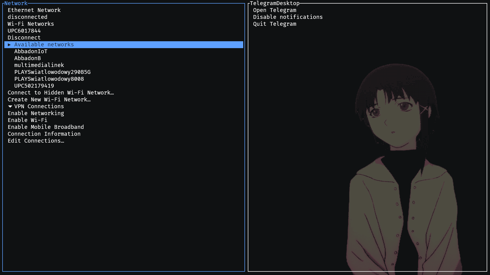

# tray-tui

A **system tray implementation** for **terminal user interfaces (TUI)** using [ratatui](https://github.com/ratatui) and [system-tray](https://github.com/jakestanger/system-tray).

## **Overview**

tray-tui brings system tray functionality to the terminal, displaying **tray menus as interactive trees**. This allows for seamless navigation of **tray menu items and quick actions**, all within a TUI environment.

## **Features**

✅ **System tray integration** in a terminal  
✅ **Interactive tree-based menu navigation**  
✅ **Built using Rust and ratatui**

## **Installation**

With cargo:

```
cargo install tray-tui
```

## **Usage**

Run `tray-tui` in the terminal or optionally pass a path to config file `tray-tui -c $CONFIG`.

## **Configuration**

Configuration file is located at `$XDG_CONFIG_HOME/tray-tui/config.toml`.
See all the configuration options in [example config](./config_example.toml).

## Showcase



## **License**

Project is licensed under [MIT](./LICENSE) license.
